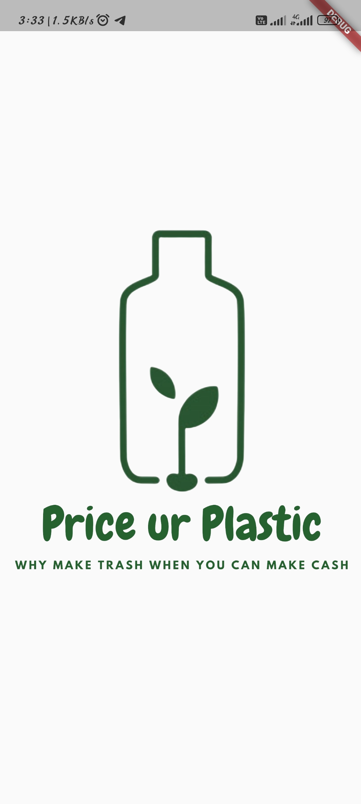
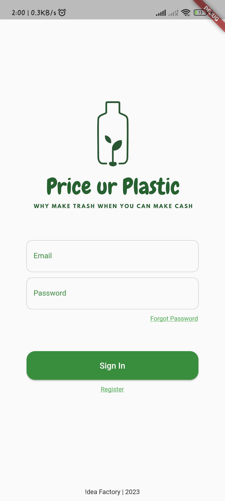
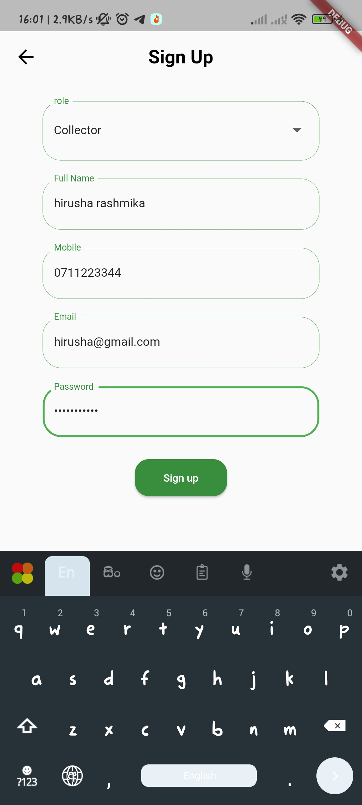
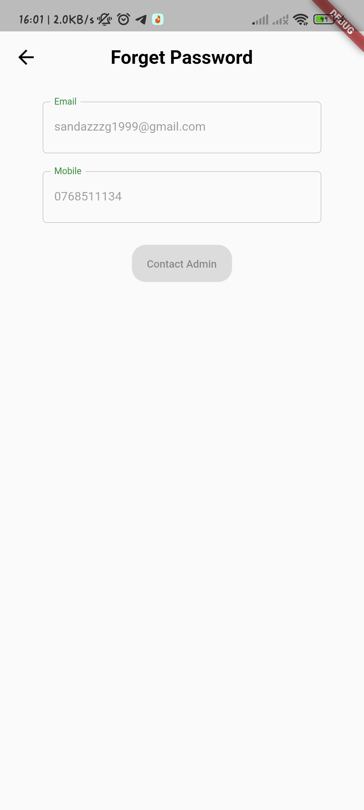
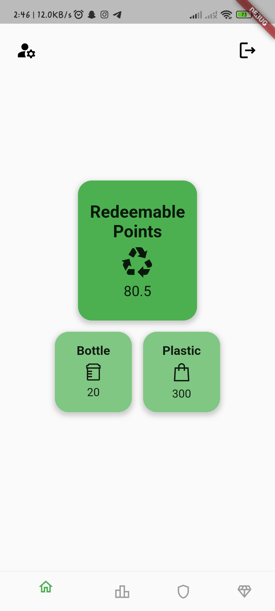
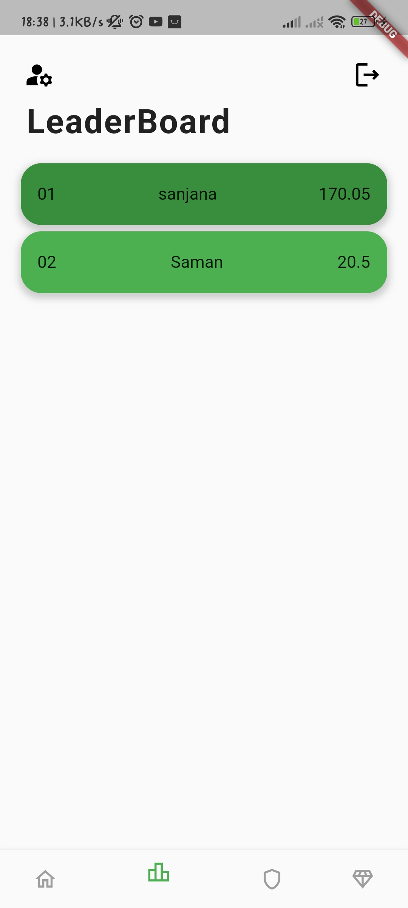
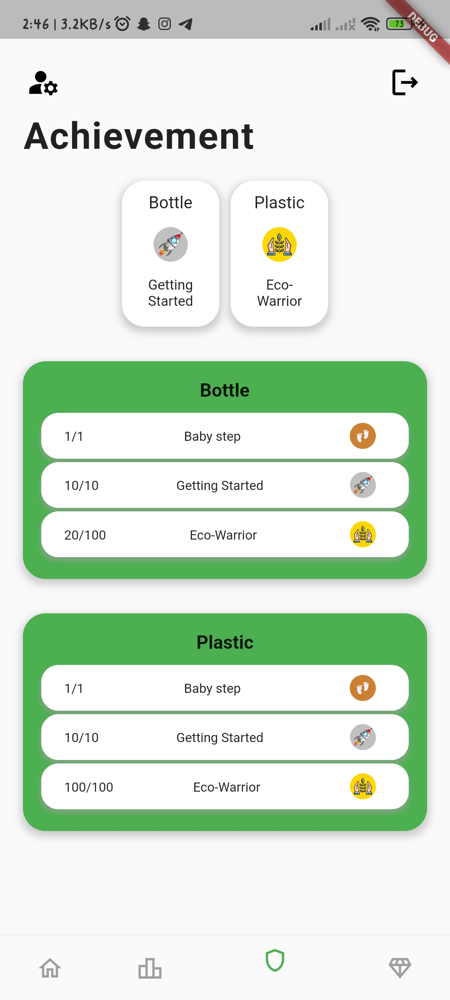
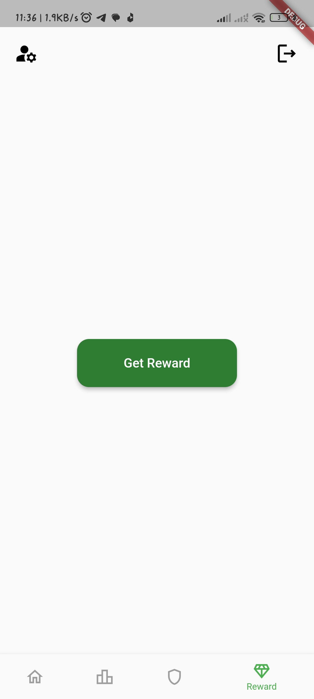
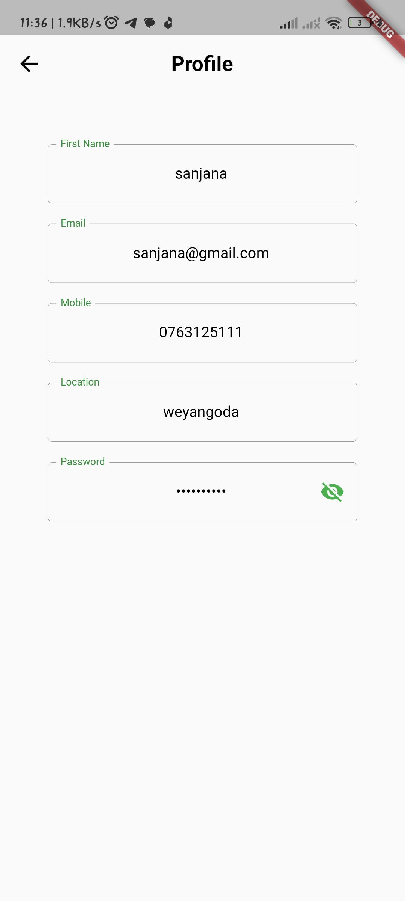

# Waste_Management_Application

## Overview

Waste_Management_Application is a Flutter mobile application aimed at waste management and reducing plastic pollution in the environment. The app facilitates a two-fold process involving donors and collectors. Donors can recycle plastic waste by either giving it to collectors or depositing it into smart bins provided through this project. Collectors, on the other hand, are responsible for collecting waste from both donors and smart bins. Both donors and collectors are rewarded based on the amount of recycled and collected waste. Additionally, the app incorporates gamification elements to encourage user engagement and participation in waste reduction efforts.

## Features

- **User Roles:** Users can select their role as either a donor or a collector upon registration.
- **Plastic Recycling:** Donors can recycle plastic waste by giving it to collectors or depositing it into smart bins.
- **Reward System:** Donors and collectors are rewarded based on the amount of recycled and collected waste, respectively.
- **Gamification:** The app includes gamification features to enhance user engagement and motivation.
- **Smart Bins:** Integration of smart bins constructed as part of the project to facilitate waste collection.
- **User Profiles:** Users can view their profiles, track their recycling or collecting progress, and manage rewards.

## Screenshots

Here are some screenshots of the application:

### Splash Screen



### Login / SignUp / ForgetPassword

   

### User Dashboard
       

## Getting Started

### Prerequisites

- Flutter SDK installed on your machine. Follow the instructions [here](https://flutter.dev/docs/get-started/install) to install Flutter.
- A compatible IDE such as Android Studio or Visual Studio Code.
- Git installed on your machine.

### Installation

1. Clone the repository:

    ```
    git clone https://github.com/sandazz/waste_management_application.git
    ```

2. Navigate to the project directory:

    ```
    cd Waste_Management_Application
    ```

3. Get dependencies:

    ```
    flutter pub get
    ```

### Running the App

1. Connect your device/emulator.

2. Run the app:

    ```
    flutter run
    ```


## Contact

If you have any questions or suggestions regarding this project, feel free to contact the project owner:

- Sandas Gimhana
- sandazzzg1999@gmail.com
